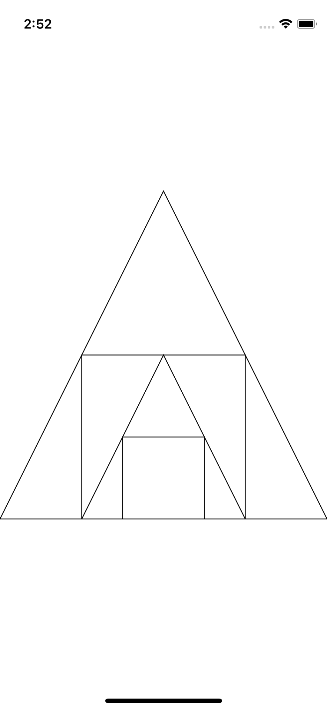
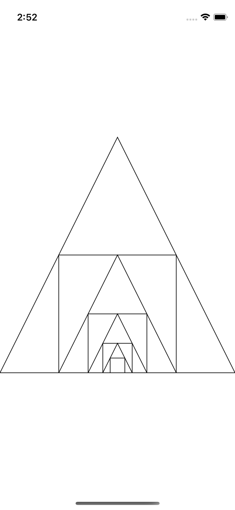

# RecursiveShapes
iOS Project to demonstrate drawing of Recursive shapes using UIKit and Swift

## Introduction
The purpose of this class project is to demonstrate drawing of an equilateral triangle and square recirsively on a view.
The rule is that the triangle must be an equilateral triangle and the square must fit inside this triangle matching it's sides aligning with the triangle.
The first shape would be the triangle followed by the square and so on recursively.
The approach used to do this task is via Shape Layer and Bezier paths. I have created a `RecursiveShapesView` class which draws the shapes over the view it is called upon.
As the first shape needs to be an equilateral triangle, I identified a drawing area which is basically a square. Imagining this square area makes it easier for the shapes to be drawn.
Take this initial drawing area's reference, I draw a triangle and then adjust the drawing area for drawing the square inside the triangle.

## Usage
```bash
recursiveShapeView = RecursiveShapesView(count: 8, frame: view.bounds)
view.addSubview(recursiveShapeView)
```

## Output
**Recursive shapes with count set as 4**

**Recursive shapes with count set as 8**


## Contact
If you have any queries/doubts/suggestions regarding this project, feel free to write me at <aarsh.parekh@live.com>

